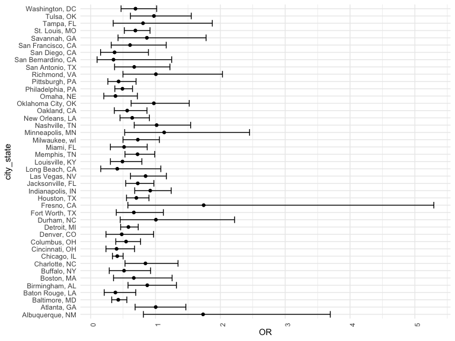
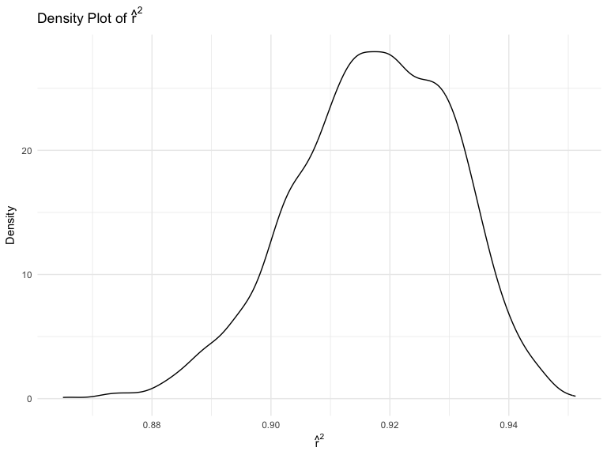
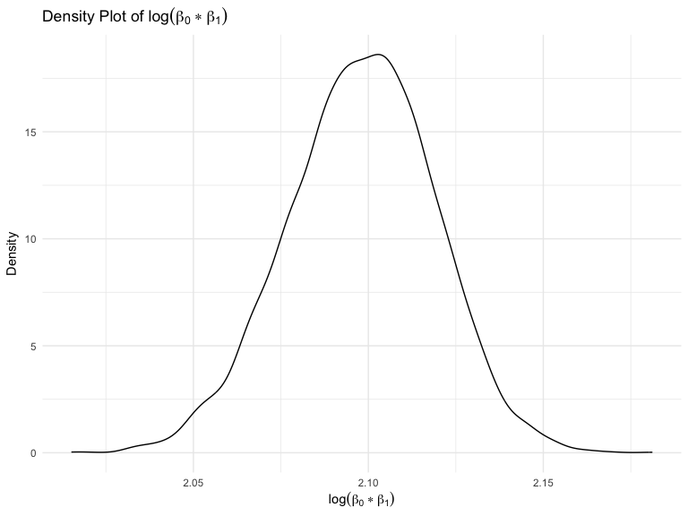
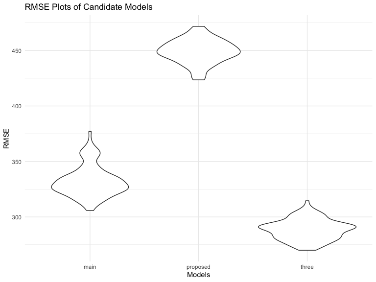

p8105_hw6_yc4384
================
Yangyang Chen
2023-11-20

# *Problem_1*

- This dataset records the crimes solved rate in each state - The
  Washington Post has gathered data on homicides in 50 large U.S.
  cities.

## *Data Pre-processing*

- Add a character variable `city_state` representing `city` and `state`
  variables;

- Add a binary variable `resolved` to indicate whether cases were solved
  or not;

- Limit `victim_race` to `black` and `white` people;

- Filter cities `Tulsa, AL`, `Dallas, TX`, `Phoenix, AZ`,
  `Kansas City, MO` as they contain NA values;

- Drop NAs to guarantee `victim_age` is numeric.

``` r
homicide_df = 
  read_csv("data/homicide-data.csv", na = c("", "NA", "Unknown")) |> 
  mutate(
    city_state = str_c(city, state, sep = ", "),
    victim_age = as.numeric(victim_age),
    resolved = as.numeric(disposition == "Closed by arrest")
  ) |> 
  filter(victim_race %in% c("Black", "White"),
         !(city_state %in% c("Tulsa, AL", "Dallas, TX", "Phoenix, AZ", "Kansas City, MO"))) |> 
  drop_na() |> 
  select(resolved, victim_age, victim_race, victim_sex, city_state)
```

## *Fitting Logistics Regression For Baltimore*

- We fitted a model using age, sex and race variables to compute odds
  ratio and confidence interval of solving homicides comparing male
  victims to female victims keeping all other variables fixed.

``` r
fit_logistic = 
  homicide_df |> 
  filter(city_state == "Baltimore, MD") |> 
  glm(resolved ~ victim_age + victim_sex + victim_race, data = _, family = binomial()) |>
  broom::tidy() |> 
  mutate(OR = exp(estimate),
         conf.low = exp(estimate - 1.96 * std.error),
         conf.high = exp(estimate + 1.96 * std.error)) |> 
  select(term, estimate, OR, starts_with("conf")) |> 
  knitr::kable(digits = 3)
fit_logistic
```

| term             | estimate |    OR | conf.low | conf.high |
|:-----------------|---------:|------:|---------:|----------:|
| (Intercept)      |    0.310 | 1.363 |    0.975 |     1.907 |
| victim_age       |   -0.007 | 0.993 |    0.987 |     1.000 |
| victim_sexMale   |   -0.854 | 0.426 |    0.325 |     0.558 |
| victim_raceWhite |    0.842 | 2.320 |    1.648 |     3.268 |

## *Fitting Logistics Regression For Each City*

- Then we used `map` function to obtain each city’s Adjusted Odds Ratio
  and CIs for solving homicides comparing male victims to female
  victims.

``` r
city_logistic = 
  homicide_df |> 
  group_by(city_state)|> 
  nest(data = -city_state) |> 
  mutate(
    glm_logistics = map(.x = data, ~glm(resolved ~ victim_age + victim_sex + victim_race, data = .x, family = binomial())),
    tidy_tests = map(glm_logistics, broom::tidy)) |>  #mapping
  unnest(tidy_tests) |> 
  mutate(
    OR = exp(estimate),
    conf.low = exp(estimate - 1.96 * std.error),
    conf.high = exp(estimate + 1.96 * std.error)
  ) |> #CI
  select(city_state, term, OR, starts_with("conf.")) |> # table labels
  mutate(city_state = fct_reorder(city_state, OR)) |> 
  filter(term == "victim_sexMale") 
  
city_logistic |> 
  head() |> 
  knitr::kable(digits = 3)
```

| city_state      | term           |    OR | conf.low | conf.high |
|:----------------|:---------------|------:|---------:|----------:|
| Albuquerque, NM | victim_sexMale | 1.734 |    0.814 |     3.695 |
| Atlanta, GA     | victim_sexMale | 1.003 |    0.686 |     1.468 |
| Baltimore, MD   | victim_sexMale | 0.426 |    0.325 |     0.558 |
| Baton Rouge, LA | victim_sexMale | 0.381 |    0.209 |     0.695 |
| Birmingham, AL  | victim_sexMale | 0.873 |    0.576 |     1.322 |
| Boston, MA      | victim_sexMale | 0.665 |    0.352 |     1.256 |

## *Plotting for ORs and CIs in Each City*

``` r
city_logistic |> 
  mutate(city_state = fct_reorder(city_state, OR)) |> 
  ggplot(aes(x = OR, y = city_state)) +
  geom_point() +
  geom_errorbar(aes(xmax = conf.high, xmin = conf.low)) +
  theme(axis.text.x = element_text(angle = 90, hjust = 1))
```



- From the above plot, we observed that Washington, DC has the lowest
  odds ratio, indicating the lowest resolved homicide cases; while
  Albuquerque, NM, has the highest odds ratio.

- Noticing that Fresno, CA has the widest confidence interval of OR
  among all cities, while Balttimore, MD has the narrowest confidence
  interval. Overall, there exists plenty of overlapping areas of CIs
  among all cities.

# *Problem 2*

## *Importing weather data*

- Codes are provided by this course:

``` r
weather_df = 
  rnoaa::meteo_pull_monitors(
    c("USW00094728"),
    var = c("PRCP", "TMIN", "TMAX"), 
    date_min = "2022-01-01",
    date_max = "2022-12-31") |>
  mutate(
    name = recode(id, USW00094728 = "CentralPark_NY"),
    tmin = tmin / 10,
    tmax = tmax / 10) |>
  select(name, id, everything())
```

    ## using cached file: /Users/cathy/Library/Caches/org.R-project.R/R/rnoaa/noaa_ghcnd/USW00094728.dly

    ## date created (size, mb): 2023-09-28 10:22:43.369738 (8.524)

    ## file min/max dates: 1869-01-01 / 2023-09-30

## *Plotting bootstrap sampling estimators using simple Linear regression model*

- To obtain a distribution for $\hat{r}^2$, we’ll follow basically the
  same procedure we used for regression coefficients: draw bootstrap
  samples; the a model to each; extract the value I’m concerned with;
  and summarize. Here, we’ll use `modelr::bootstrap` to draw the samples
  and `broom::glance` to produce `r.squared` values.

``` r
weather_df |> 
  modelr::bootstrap(n = 5000) |> 
  mutate(
    models = map(strap, \(df) lm(tmax ~ tmin + prcp, data = df)),
    results = map(models, broom::glance) 
  ) |> 
  select(results) |> 
  unnest(results) |> 
  ggplot(aes(x = r.squared)) +
  geom_density() +
  labs(title = TeX("Density Plot of $\\hat{r}^2$"), x = TeX("$\\hat{r}^2$"), y = TeX("Density" )) 
```



- The above plot shows that $\hat{r}^2$ is high, leading to the
  generally skewed shape of the density distribution.

- If we wanted to construct a confidence interval for $R^2$, we could
  take the 2.5% and 97.5% quantiles of the estimates across bootstrap
  samples. Nevertheless, since the shape isn’t symmetric, using the mean
  +/- 1.96 times the standard error probably wouldn’t work well.

- We can produce a distribution for $\log(\beta_0 * \beta_1)$ using a
  similar approach, with a bit more wrangling before we make our plot.

``` r
weather_df |> 
  modelr::bootstrap(n = 5000) |> 
  mutate(
    models = map(strap, \(df) lm(tmax ~ tmin + prcp, data = df)),
    results = map(models, broom::tidy)
  ) |> 
  select(-strap, -models) |> 
  unnest(results) |> 
  select(id = ".id", term, estimate) |> 
  pivot_wider(
    names_from = term,
    values_from = estimate
  ) |> 
  rename(beta0 = "(Intercept)", beta1 = tmin) |> 
  mutate(log_beta0_beta1 = log(beta0 * beta1)) |> 
  ggplot(aes(x = log_beta0_beta1)) +
  geom_density() +  
  labs(title = TeX("Density Plot of $\\log(\\beta_0*\\beta_1)$"), x = TeX("$\\log(\\beta_0*\\beta_1)$"), y = TeX("Density" )) 
```



- As with $r^2$, this distribution is somewhat skewed and has some
  outliers.

# *Problem 3*

This dataset consists of roughly 4000 children’s information and
includes 20 variables, and our task is understand the effects of sevral
variables on a child’s birthweight.

## *Data Pre-processing*

These are character variables that needs to be cleaned first:

- `babysex`: baby’s sex (male = 1, female = 2)

- `frace`: father’s race (1 = White, 2 = Black, 3 = Asian, 4 = Puerto
  Rican, 8 = Other, 9 = Unknown)

- `malform`: presence of malformations that could affect weight (0 =
  absent, 1 = present)

- `mrace`: mother’s race (1 = White, 2 = Black, 3 = Asian, 4 = Puerto
  Rican, 8 = Other)

``` r
bwt_df = 
  read_csv("data/birthweight.csv") |> 
  mutate(
    babysex = as.factor(babysex),
    babysex = recode(babysex, "1" = "Male", "2" = "Female"),
    frace = as.factor(frace),
    frace = recode(frace, "1" = "White", "2" = "Black", "3" = "Asian", "4" = "Puerto Rican", "8" = "Other", "9" = "Unknown"),
    malform = as.factor(malform),
    malform = recode(malform, "0" = "Absent", "1" = "Present"),
    mrace = as.factor(mrace),
    mrace = recode(mrace, "1" = "White", "2" = "Black", "3" = "Asian", "4" = "Puerto Rican", "8" = "Other")
  )
```

    ## Rows: 4342 Columns: 20
    ## ── Column specification ────────────────────────────────────────────────────────
    ## Delimiter: ","
    ## dbl (20): babysex, bhead, blength, bwt, delwt, fincome, frace, gaweeks, malf...
    ## 
    ## ℹ Use `spec()` to retrieve the full column specification for this data.
    ## ℹ Specify the column types or set `show_col_types = FALSE` to quiet this message.

``` r
head(bwt_df)
```

    ## # A tibble: 6 × 20
    ##   babysex bhead blength   bwt delwt fincome frace gaweeks malform menarche
    ##   <fct>   <dbl>   <dbl> <dbl> <dbl>   <dbl> <fct>   <dbl> <fct>      <dbl>
    ## 1 Female     34      51  3629   177      35 White    39.9 Absent        13
    ## 2 Male       34      48  3062   156      65 Black    25.9 Absent        14
    ## 3 Female     36      50  3345   148      85 White    39.9 Absent        12
    ## 4 Male       34      52  3062   157      55 White    40   Absent        14
    ## 5 Female     34      52  3374   156       5 White    41.6 Absent        13
    ## 6 Male       33      52  3374   129      55 White    40.7 Absent        12
    ## # ℹ 10 more variables: mheight <dbl>, momage <dbl>, mrace <fct>, parity <dbl>,
    ## #   pnumlbw <dbl>, pnumsga <dbl>, ppbmi <dbl>, ppwt <dbl>, smoken <dbl>,
    ## #   wtgain <dbl>

``` r
sum(is.na(bwt_df))
```

    ## [1] 0

After cleaning and inspecting the dataset, we didn’t find any missing
data values.

## *Model Construction*

``` r
bwt_lm = 
  lm(bwt ~ babysex + fincome + gaweeks + malform + smoken + wtgain, data = bwt_df)

summary(bwt_lm) 
```

    ## 
    ## Call:
    ## lm(formula = bwt ~ babysex + fincome + gaweeks + malform + smoken + 
    ##     wtgain, data = bwt_df)
    ## 
    ## Residuals:
    ##      Min       1Q   Median       3Q      Max 
    ## -1831.95  -282.98     7.54   291.34  1583.67 
    ## 
    ## Coefficients:
    ##                Estimate Std. Error t value Pr(>|t|)    
    ## (Intercept)    474.8052    85.3530   5.563 2.81e-08 ***
    ## babysexFemale  -90.4794    13.6086  -6.649 3.32e-11 ***
    ## fincome          2.4426     0.2639   9.255  < 2e-16 ***
    ## gaweeks         61.0335     2.1920  27.844  < 2e-16 ***
    ## malformPresent   0.7492   115.8778   0.006    0.995    
    ## smoken          -7.3697     0.9211  -8.001 1.57e-15 ***
    ## wtgain           9.0620     0.6287  14.415  < 2e-16 ***
    ## ---
    ## Signif. codes:  0 '***' 0.001 '**' 0.01 '*' 0.05 '.' 0.1 ' ' 1
    ## 
    ## Residual standard error: 447.5 on 4335 degrees of freedom
    ## Multiple R-squared:  0.2377, Adjusted R-squared:  0.2366 
    ## F-statistic: 225.3 on 6 and 4335 DF,  p-value: < 2.2e-16

As p-values \< 0.05 (except `malform`), the proposed model is
significantly useful.

## *Plotting - residuals vs. fitted values*

- Create a plot of model residuals against fitted values.

``` r
bwt_plot = 
  bwt_df |> 
  modelr::add_predictions(bwt_lm) |> 
  modelr::add_residuals(bwt_lm) |> 
  ggplot(aes(x = pred, y = resid)) +
  geom_point(alpha = .2) +
  labs(
    x = "Fitted Values",
    y = "Residuals",
    title = "Residuals vs Fitted Values"
  )

bwt_plot
```


## *Cross Validation*

- Comparison of three models using RMSE.

``` r
set.seed(1)

cv_df = 
  crossv_mc(bwt_df, 100) |> 
  mutate(
    main_mod = map(train, \(train) lm(bwt ~ blength + gaweeks, data = train) ),
    three_mod = map(train, \(train) lm(bwt ~ bhead * blength * babysex, data = train)),
    proposed_mod = map(train, \(train) lm(bwt ~ babysex + fincome + gaweeks + malform + smoken + wtgain, data = train))
  ) |> 
  mutate(
    rmse_main = map2_dbl(main_mod, test, \(mod, test) rmse(model = mod, data = test)),
    rmse_three = map2_dbl(three_mod, test, \(mod, test) rmse(model = mod, data = test)),
    rmse_proposed = map2_dbl(proposed_mod, test, \(mod, test) rmse(model = mod, data = test))
  )

cv_df
```

    ## # A tibble: 100 × 9
    ##    train                   test                  .id   main_mod three_mod
    ##    <list>                  <list>                <chr> <list>   <list>   
    ##  1 <resample [3,473 x 20]> <resample [869 x 20]> 001   <lm>     <lm>     
    ##  2 <resample [3,473 x 20]> <resample [869 x 20]> 002   <lm>     <lm>     
    ##  3 <resample [3,473 x 20]> <resample [869 x 20]> 003   <lm>     <lm>     
    ##  4 <resample [3,473 x 20]> <resample [869 x 20]> 004   <lm>     <lm>     
    ##  5 <resample [3,473 x 20]> <resample [869 x 20]> 005   <lm>     <lm>     
    ##  6 <resample [3,473 x 20]> <resample [869 x 20]> 006   <lm>     <lm>     
    ##  7 <resample [3,473 x 20]> <resample [869 x 20]> 007   <lm>     <lm>     
    ##  8 <resample [3,473 x 20]> <resample [869 x 20]> 008   <lm>     <lm>     
    ##  9 <resample [3,473 x 20]> <resample [869 x 20]> 009   <lm>     <lm>     
    ## 10 <resample [3,473 x 20]> <resample [869 x 20]> 010   <lm>     <lm>     
    ## # ℹ 90 more rows
    ## # ℹ 4 more variables: proposed_mod <list>, rmse_main <dbl>, rmse_three <dbl>,
    ## #   rmse_proposed <dbl>

- Finally, plotting the prediction error distribution for each candidate
  models.

``` r
cv_plot = 
  cv_df |> 
  select(starts_with("rmse")) |> 
  pivot_longer(
    everything(),
    names_to = "model",
    values_to = "rmse",
    names_prefix = "rmse_"
  ) |> 
  mutate(
    model = recode(model, "main_mod" = "Main Effect Model", "three_mod" = "Three-way Model", "proposed_mod" = "Proposed Model")
    ) |> 
  ggplot(aes(x = model, y = rmse)) + 
  geom_violin() +
  labs(
    x = "Models",
    y = "RMSE",
    title =  "RMSE Plots of Candidate Models"
  )

cv_plot
```



- Above plot shows that the three-way model, which consists of the head
  circumference, length, sex, and all interactions, has the lowest RMSE
  among all models, indicates that it is the optimal regression model.

- While the main effect model, consisting of length at birth and
  gestational age, has a RMSE that is greater than that of three-way
  model, but less than that of the proposed model. This demonstates that
  main effect model is the second optimal model.

- Finally, proposed model has the highest RMSE, illustrating that it is
  the worst model amoung other three.
