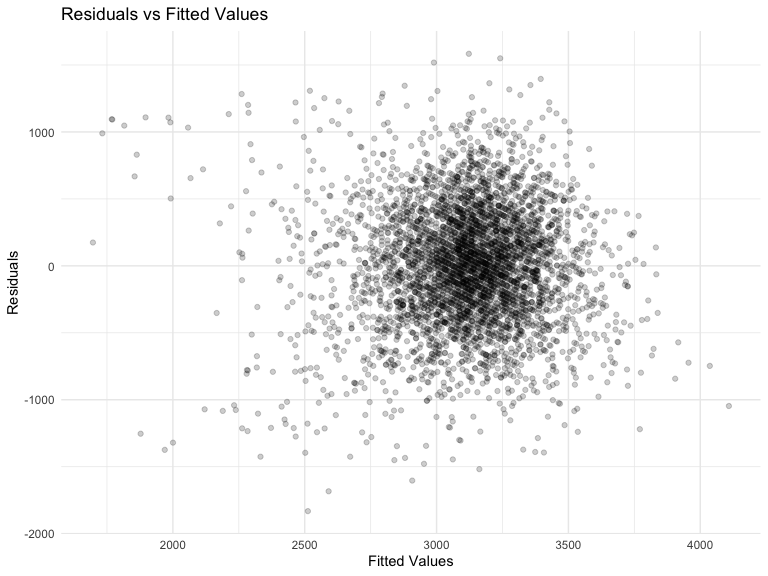

p8105_hw6_yc4384
================
Yangyang Chen
2023-11-19

# *Problem_1*

This dataset records the crimes solved rate in each state - The
Washington Post has gathered data on homicides in 50 large U.S. cities.

## *Data pre-processing*

- Add a character variable `city_state` representing `city` and `state`
  variables;

- Add a binary variable `resolved` to indicate whether cases were solved
  or not;

- Limit `victim_race` to `black` and `white` people;

- Filter cities `Tulsa, AL`, `Dallas, TX`, `Phoenix, AZ`,
  `Kansas City, MO` as they contain NA values;

- Drop NAs to guarantee `victim_age` is numeric.

``` r
homicide_df = 
  read_csv("data/homicide-data.csv", na = c("", "NA", "Unknown")) |> 
  mutate(
    city_state = str_c(city, state, sep = ", "),
    victim_age = as.numeric(victim_age),
    resolved = as.numeric(disposition == "Closed by arrest")
  ) |> 
  filter(victim_race %in% c("Black", "White"),
         !(city_state %in% c("Tulsa, AL", "Dallas, TX", "Phoenix, AZ", "Kansas City, MO"))) |> 
  drop_na() |> 
  select(resolved, victim_age, victim_race, victim_sex, city_state)
```

## *Fitting Logistics Regression For Baltimore, MD*

I fitted a model using age, sex and race variables to compute odds ratio
and confidence interval of solving homicides comparing male victims to
female victims keeping all other variables fixed.

``` r
fit_logistic = 
  homicide_df |> 
  filter(city_state == "Baltimore, MD") |> 
  glm(resolved ~ victim_age + victim_sex + victim_race, data = _, family = binomial()) |>
  broom::tidy() |> 
  mutate(OR = exp(estimate),
         conf.low = exp(estimate - 1.96 * std.error),
         conf.high = exp(estimate + 1.96 * std.error)) |> 
  select(term, estimate, OR, starts_with("conf")) |> 
  knitr::kable(digits = 3)
fit_logistic
```

| term             | estimate |    OR | conf.low | conf.high |
|:-----------------|---------:|------:|---------:|----------:|
| (Intercept)      |    0.310 | 1.363 |    0.975 |     1.907 |
| victim_age       |   -0.007 | 0.993 |    0.987 |     1.000 |
| victim_sexMale   |   -0.854 | 0.426 |    0.325 |     0.558 |
| victim_raceWhite |    0.842 | 2.320 |    1.648 |     3.268 |

## *Fitting Logistics Regression For Each City*

Then I used `map` function to obtain each city’s Adjusted Odds Ratio and
CIs for solving homicides comparing male victims to female victims.

``` r
city_logistic = 
  homicide_df |> 
  group_by(city_state)|> 
  nest(data = -city_state) |> 
  mutate(
    glm_logistics = map(.x = data, ~glm(resolved ~ victim_age + victim_sex + victim_race, data = .x, family = binomial())),
    tidy_tests = map(glm_logistics, broom::tidy)) |>  #mapping
  unnest(tidy_tests) |> 
  mutate(
    OR = exp(estimate),
    conf.low = exp(estimate - 1.96 * std.error),
    conf.high = exp(estimate + 1.96 * std.error)
  ) |> #CI
  select(city_state, term, OR, starts_with("conf.")) |> # table labels
  mutate(city_state = fct_reorder(city_state, OR)) |> 
  filter(term == "victim_sexMale") 
  
city_logistic |> 
  head() |> 
  knitr::kable(digits = 3)
```

| city_state      | term           |    OR | conf.low | conf.high |
|:----------------|:---------------|------:|---------:|----------:|
| Albuquerque, NM | victim_sexMale | 1.734 |    0.814 |     3.695 |
| Atlanta, GA     | victim_sexMale | 1.003 |    0.686 |     1.468 |
| Baltimore, MD   | victim_sexMale | 0.426 |    0.325 |     0.558 |
| Baton Rouge, LA | victim_sexMale | 0.381 |    0.209 |     0.695 |
| Birmingham, AL  | victim_sexMale | 0.873 |    0.576 |     1.322 |
| Boston, MA      | victim_sexMale | 0.665 |    0.352 |     1.256 |

## Plotting for ORs and CIs in Each City

``` r
city_logistic |> 
  mutate(city_state = fct_reorder(city_state, OR)) |> 
  ggplot(aes(x = OR, y = city_state)) +
  geom_point() +
  geom_errorbar(aes(xmax = conf.high, xmin = conf.low)) +
  theme(axis.text.x = element_text(angle = 90, hjust = 1))
```



From the above plot, we observed that Washington, DC has the lowest odds
ratio, indicating the lowest resolved homicide cases; while Albuquerque,
NM, has the highest odds ratio. Noticing that Fresno, CA has the widest
confidence interval of OR among all cities, while Balttimore, MD has the
narrowest confidence interval. Overall, there exists plenty of
overlapping areas of CIs among all cities.
